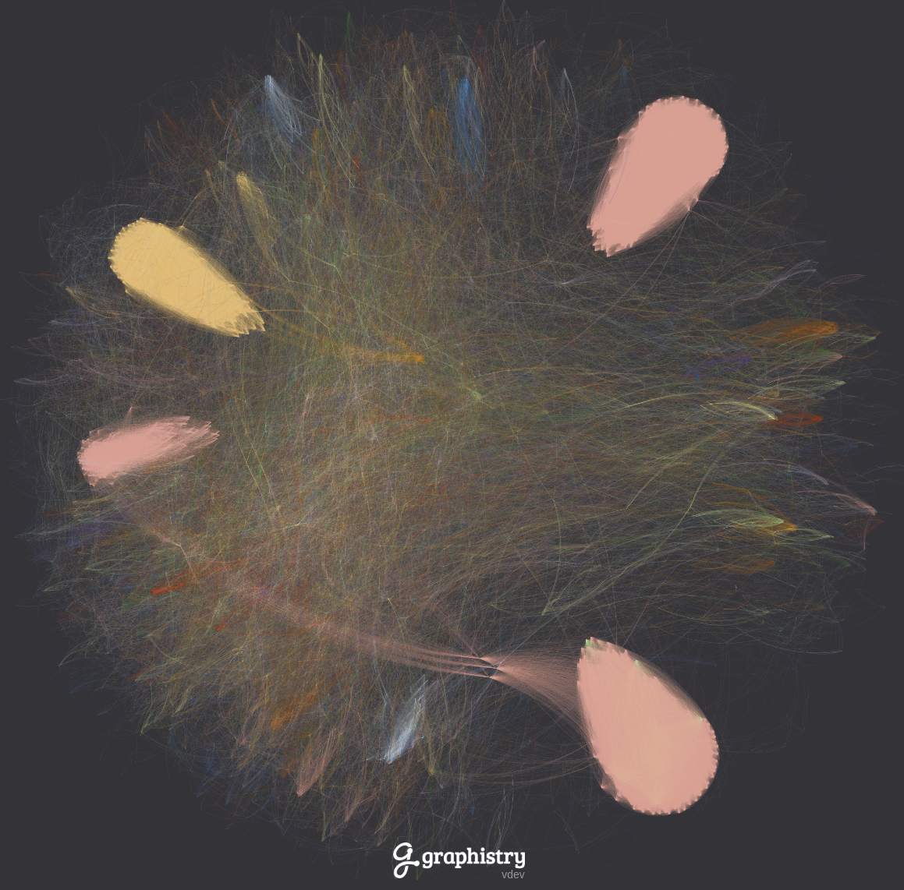
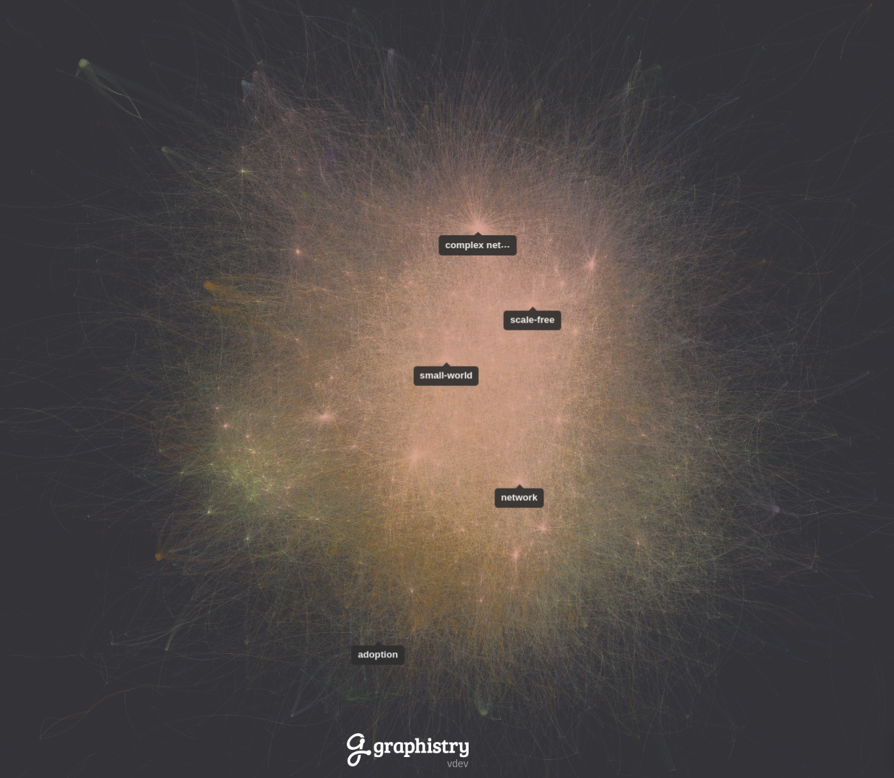
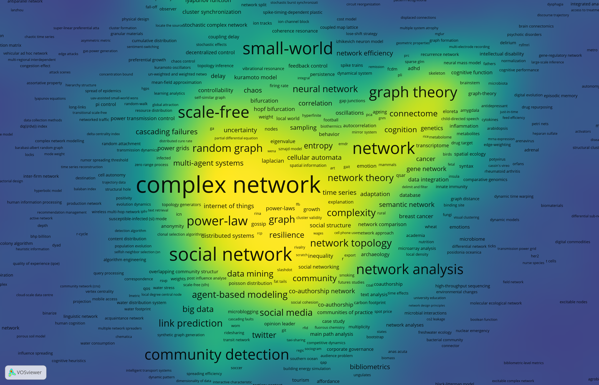
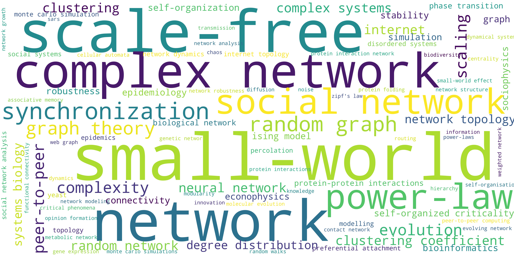
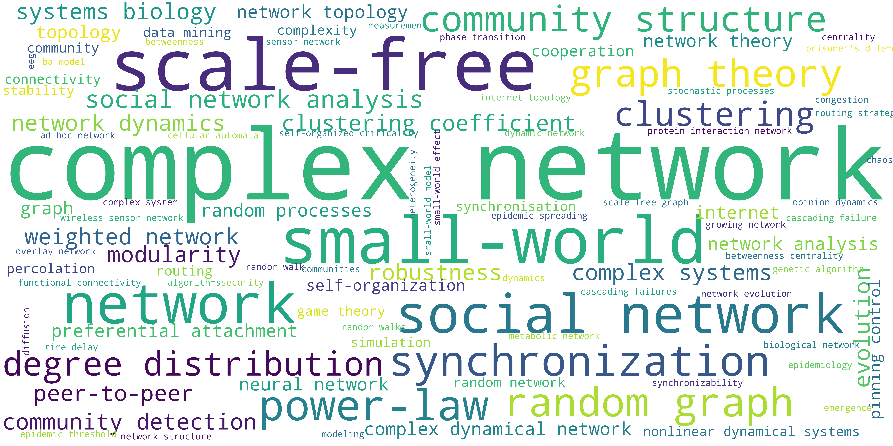
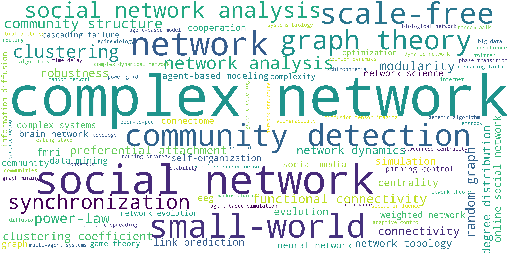
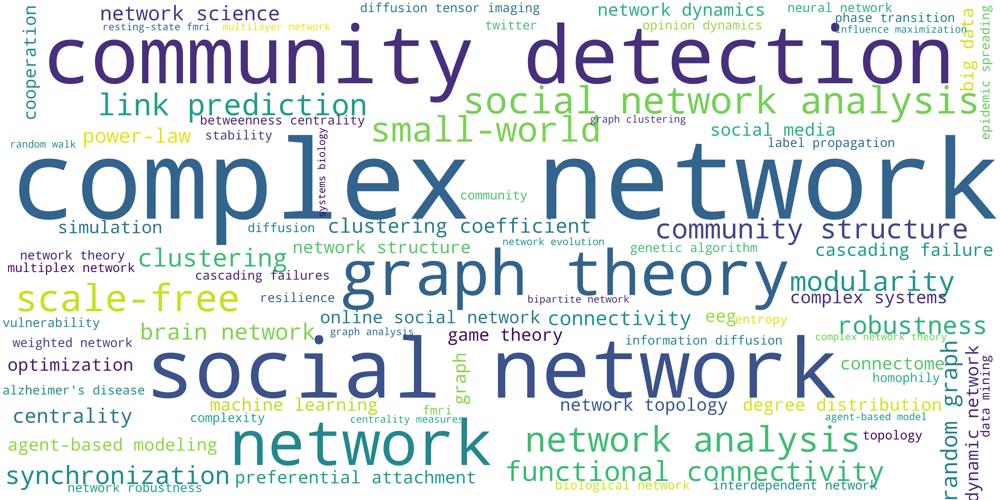

# Twenty-Years-of-Network-Science
Supplementary material for the paper *Twenty Years of Network Science: A Bibliographic and Co-authorship Network Analysis* - R. Molontay, M. Nagy (2020)

The aforementioned paper is an extension of a [prior work](https://github.com/marcessz/Two-Decades-of-Network-Science) of the same authors, titled *Two Decades of Network Science - as seen through the co-authorship network of network scientists*.

## How to Cite
```
@book{molontay2020twenty,
  title={Twenty Years of Network Science: A Bibliographic and Co-authorship Network Analysis},
  author={Molontay, Roland and Nagy, Marcell},
  year={2020},
  publisher={Springer}
  }
```

## Source
The data were collected from the Web of Science core collection

## Data

The edgelist of the constructed network can be found in [this folder](./network-edge-list)

## Network
The graphistry visualization of the largest connected component of the co-authorship network.



## Keyword co-occurence network
Two keywords are connected if they co-occur in at least one article. The weight of the edges are the frequency of the co-occurene of the endpoint keywords. 

### Graphistry 
The interactive graphistry visualization of the network can be found __[here](https://labs.graphistry.com/graph/graph.html?dataset=PyGraphistry%2FQ6Z1AND1TS&type=vgraph&viztoken=1fa4a572a30ddf10048dcef808c41d93ad15e677&usertag=04ce45d1-pygraphistry-0.9.64&info=true&workbook=4987c538fd6e219d)__.



### VOSviewer
The density visualization of the co-occurence network of the keyword is shown in the figure below.


## Word clouds of the keywords
We divided the two decades into the following four periods: 1989-2005, 2006-2010, 2011-2015 and 2016-2019 (May). 
The following four figures show the word clouds of the keywords of the articles written in the four periods respectively.
### Between 1998 and 2005

### Between 2006 and 2010

### Between 2010 and 2015

### Between 2016 and 2019

