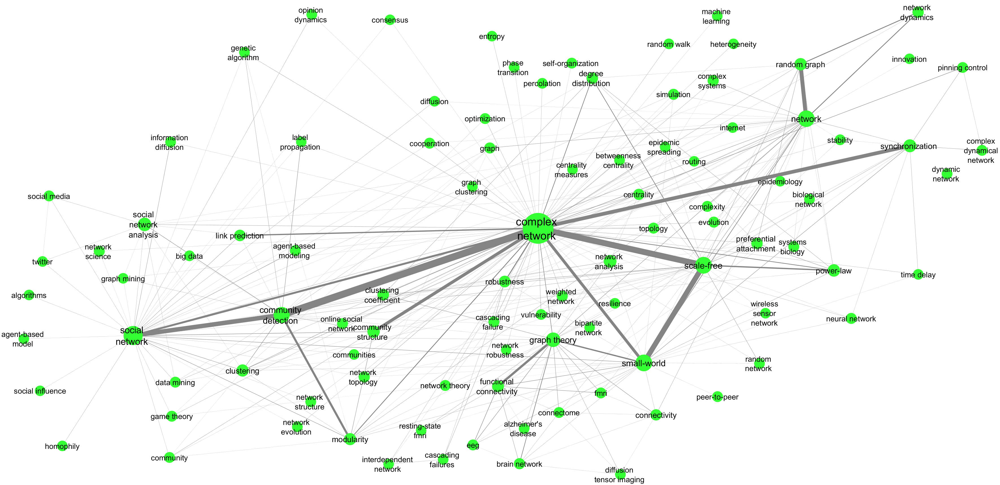

# Twenty-Years-of-Network-Science
Supplementary material for the paper *Twenty Years of Network Science: A Bibliographic and Co-Authorship Network Analysis* - R. Molontay, M. Nagy (2020)

The aforementioned paper is an extension of a [prior work](https://github.com/marcessz/Two-Decades-of-Network-Science) of the same authors, titled *Two Decades of Network Science - as seen through the co-authorship network of network scientists*.

## How to Cite
```
@article{molontay2020twenty,
  title={Twenty Years of Network Science: A Bibliographic and Co-Authorship Network Analysis},
  author={Molontay, Roland and Nagy, Marcell},
  journal={arXiv preprint arXiv:2001.09006},
  year={2020}
  }
```

## Source
The data were collected from the Web of Science core collection. We downloaded information about the articles that cited at least one of the following papers: 
* Barabási, A. L., & Albert, R. (1999). Emergence of scaling in random networks. Science, 286(5439), 509-512.
* Watts, D. J., & Strogatz, S. H. (1998). Collective dynamics of ‘small-world’networks. Nature, 393(6684), 440.
* Girvan, M., & Newman, M. E. (2002). Community structure in social and biological networks. Proceedings of the national academy of sciences, 99(12), 7821-7826.

## Data

The edgelist of the constructed network can be found in [this folder](./edge-list). 

## Network
The graphistry visualization of the largest connected component of the co-authorship network.


## Keyword co-occurence network
Two keywords are connected if they co-occur in at least one article. The weight of the edges are the frequency of the co-occurene of the endpoint keywords. 

### Graphistry 
The interactive graphistry visualization of the keyword co-occurence network can be found __[here](https://labs.graphistry.com/graph/graph.html?dataset=PyGraphistry%2FQ6Z1AND1TS&type=vgraph&viztoken=1fa4a572a30ddf10048dcef808c41d93ad15e677&usertag=04ce45d1-pygraphistry-0.9.64&info=true&workbook=4987c538fd6e219d)__.


[](https://labs.graphistry.com/graph/graph.html?dataset=PyGraphistry%2FQ6Z1AND1TS&type=vgraph&viztoken=1fa4a572a30ddf10048dcef808c41d93ad15e677&usertag=04ce45d1-pygraphistry-0.9.64&info=true&workbook=4987c538fd6e219d)

### VOSviewer
The density visualization of the co-occurence network of the keyword is shown in the figure below. Keywords that have co-occurred more frequently are placed closer to each other on the map. The font size indicates the number and strength of the connections of a keyword. A more intense color implies a larger number of keywords and higher connectivity in the neighborhood of the point. The figure was created with VOSviewer.


### Co-occurence network of keywords
The following figure shows the co-occurence network of the more frequent keywords. The size of the node indicates the frequency of keywords in network science papers, the edge width indicates their relative co-occurrence. Only keywords with frequency at least 100 and edges with weight at least 10 are shown in the figure.




## Word clouds of the keywords
We divided the two decades into the following four periods: 1989-2005, 2006-2010, 2011-2015 and 2016-2020 (January). 
The following four figures show the word clouds of the keywords of the articles written in the four periods respectively.
### Between 1998 and 2005

### Between 2006 and 2010

### Between 2010 and 2015

### Between 2016 and 2019

